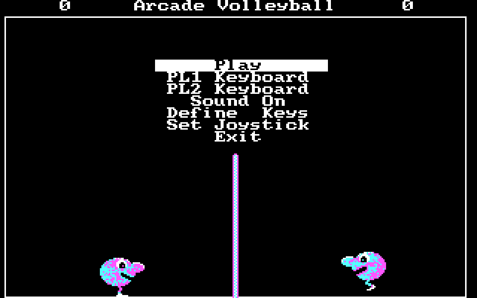

# Arcade Volleyball (1988) — reconstructed C source

This is a faithful C reconstruction of **Arcade Volleyball**, the 1988 two‑player
CGA game (Rhett Anderson / *COMPUTE!*'s PC Magazine), reverse‑engineered from the
original `AV.EXE` and `AV.DAT`. The game logic is decompiled 1:1 from the binary;
a thin SDL2 layer replaces the DOS/CGA/BGI platform so it builds and runs natively
on macOS/Linux and loads the **original `AV.DAT`** sprite data at runtime.



## Build & run

```sh
brew install sdl2          # or: apt install libsdl2-dev
make
./av                       # run from this directory (it loads ./AV.DAT)
```

### Play in the browser (WebAssembly)

The same sources build with [Emscripten](https://emscripten.org) against its
SDL2 port, with `AV.DAT` packed into the page. The decompiled game owns its
control flow (the menu busy-waits in `getch`), so the build uses `-sASYNCIFY`
to let that blocking code yield to the browser inside `SDL_Delay` — no
restructuring of the 1:1-decompiled logic:

```sh
brew install emscripten
make web       # -> web/index.html (+ .js/.wasm/.data)
make serve     # serve at http://localhost:8001 (wasm needs http, not file://)
```

The game runs at the usual deterministic 60 fps while the tab is visible;
browsers throttle background timers, so a hidden tab crawls at ~1 fps until
it is foregrounded again.

### Headless under wasmtime (WASI)

Only `platform.c` touches SDL, so the whole game also builds as a pure WASI
module: [`src/platform_wasi.c`](src/platform_wasi.c) supplies the platform
layer (no display/audio/clock, frames run flat out) and honours the same
`AV_INJECT` / `AV_SHOT` env contract as the native build — a scripted match
under wasmtime is **byte-identical, frame for frame**, to a native
`SDL_VIDEODRIVER=dummy` run (verified against `tools/verify_golden.sh`'s
golden frames):

```sh
brew install wasmtime wasi-libc emscripten   # emscripten just for its clang/wasm-ld
make wasi
make run-wasi     # scripted 140-frame match -> frame.ppm
```

(Any wasm-capable clang works instead of emscripten's — override with
`make wasi WASI_CC=/path/to/clang`.)

### Controls

| | Left | Right | Jump |
|--|--|--|--|
| **Player 1** | `Z` | `C` | `X` |
| **Player 2** | numpad `1` / `End` | numpad `3` / `PgDn` | numpad `2` / `↓` |

(The `End`/`PgDn`/`↓` aliases are faithful: the nav cluster sends E0-prefixed
keypad codes, and the original's ISR ignored the E0 prefix.)

Menu: `↑`/`↓` (or `8`/`2`) to move, **Enter** to select, `Esc` to quit.
Select **Play** to start; **PL1/PL2** cycle Keyboard/Joystick/Mouse/Computer;
**Define Keys** rebinds; **Set Joystick** calibrates.

## What was reverse‑engineered

`AV.EXE` is a Turbo C 1987, small‑model, real‑mode DOS program (37 KB) linked with
Borland's BGI graphics library and an embedded CGA driver. The reconstruction:

* **Parsed the MZ image** — entry point, relocations, and the single 64 KB data
  segment (DGROUP). `main` is at code offset `0x1a5`.
* **Disassembled** the 9 KB of game code (`0x115`–`0x2474`) with a recursive/
  linear pass that resolves the four embedded `switch` jump tables
  (`tools/refine2.py`), yielding **32 functions**.
* **Decoded `AV.DAT`** (`tools/decode_dat.py`): 20 concatenated BGI `getimage`
  buffers = the two blob players (stand/walk/jump, each mirrored), the volleyball
  (large + small, 4 rotation frames each), the net, and the posts. Bytes‑per‑row
  is `(width+4)>>2`, exactly as `draw_sprite` reads them.
* **Reconstructed the data segment byte‑exact** — `src/ds_init.h` is the verbatim
  DGROUP image from the EXE, so all string tables, the menu layout, and the
  default key bindings are preserved without guessing.
* **Decompiled every function** to C against a flat‑memory model (see below),
  then adversarially verified each against its disassembly.

Key mechanics recovered: the CGA **pre‑shifted‑sprite** blitter (`draw_sprite`,
`0x22d0`) that weaves rows into the two interleaved CGA banks and uses the low 2
bits of X to pick one of four pre‑shifted copies; the erase blitter
(`draw_sprite2`, `0x23e2`); the ball/player **physics** and **collision**
(`collide_check`, `0x199b`); the **computer AI** (`sub_019f4`); the custom
**INT 9 keyboard ISR**; joystick (game port `0x201`), mouse (INT 33h), and
PC‑speaker sound.

## How the model works (fidelity)

The original is small‑model, so its entire world is one 64 KB segment. We mirror
that exactly (`src/dos.h`):

* `DS[0x10000]` — the data segment: string constants, globals (BSS) **and** the
  malloc heap. A "near pointer" is just an offset into `DS[]` (`dsptr`), so a
  sprite pointer stored in a global is byte‑for‑byte what the original stored.
* `VIDEO[0x4000]` — the CGA `0xB800` framebuffer (two interleaved 2bpp banks),
  de‑interleaved to the window each frame with the CGA palette.
* Accessors `B/SB/W/UW(off)` model 8/16‑bit, signed/unsigned access; `int` is
  16‑bit as in Turbo C. Named macros (`ball_x`, `p1_y`, …) alias the offsets.

This makes the decompiled functions faithful *and* consistent: they operate on
the same memory the binary did.

## Project layout

```
AV.EXE, AV.DAT        the original 1988 binaries (inputs)
src/
  dos.h               memory model, accessors, named globals, shim API
  dos.c               DS[]/VIDEO[] + small-model malloc; ds_init.h loader
  ds_init.h           verbatim DGROUP image from AV.EXE (strings/menu/keys)
  game.c              hand-verified core: draw_sprite/2, preshift, load_data
  gen/*.c             the 22 decompiled game functions (game_main, play_round,
                      menu_draw, setup_round, sub_02008 rally, sub_019f4 AI, …)
  game_protos.h       prototypes for the decompiled functions
  shim.c              Borland BGI + RTL over VIDEO[] (imagesize/getimage/bar/
                      outtextxy/rectangle, file I/O, 8x8 text)
  rtl.c               Turbo C RTL: getch/kbhit/bioskey, sound/nosound, itoa, delay
  input.c             the INT 9 keyboard ISR, re-expressed and fed by SDL
  platform.c          SDL2 window/present/input/timing + entry point
  font8x8.h           8x8 text font for outtextxy
tools/                the reverse-engineering scripts (disasm, DAT decode, …)
build/                disassembly, decoded sprites, screenshots (generated)
```

## Notes / limitations

* Rendering, sprites, physics, menu and input are reproduced from the binary and
  the original `AV.DAT`. Text uses a hand‑authored 8×8 bitmap font in the IBM/BGI
  style (`tools/genfont.py` → `src/font8x8.h`); content is exact.
* PC‑speaker sound is emulated as an SDL square‑wave device (`platform.c`),
  driven by the decompiled `sound()`/`nosound()` call sites and gated by the
  "Sound On/Off" menu item.
* A couple of decompiled locals are unused ("set but not used") — those are dead
  stores present in the original, kept for fidelity.
* Run from this directory so `AV.DAT` is found.
```
```
